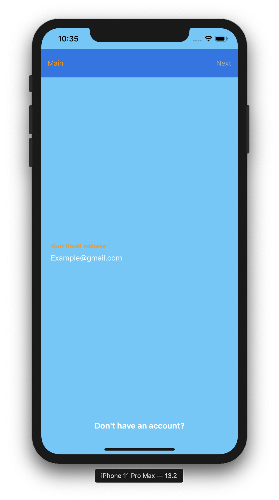

# Firebase-LoginFunctions

파이어베이스를 이용하여 만든 로그인 기능 입니다.

## Getting Started

다른 프로젝트에서 로그인 기능 구현이 필요하다면 이 프로젝트를 사용할 수 있습니다.

## Built With

* [Firebase](https://firebase.google.com/?&gclid=Cj0KCQjwoqDtBRD-ARIsAL4pviClBagMFchiylPsW0mbn23HtPWgLjiTXemq6dYC8telVepxfJKnWtcaAnbtEALw_wcB) - The login framework used

## Versioning

## License

This project is licensed under the MIT License - see the [LICENSE.md](https://github.com/Axe-Num1/Firebase-LoginFunctions/blob/master/LICENSE) file for details

## Authors

* **Kang Minseok** - *Axe-Num1* - [Axe's Life](https://axe-num1.tistory.com)
